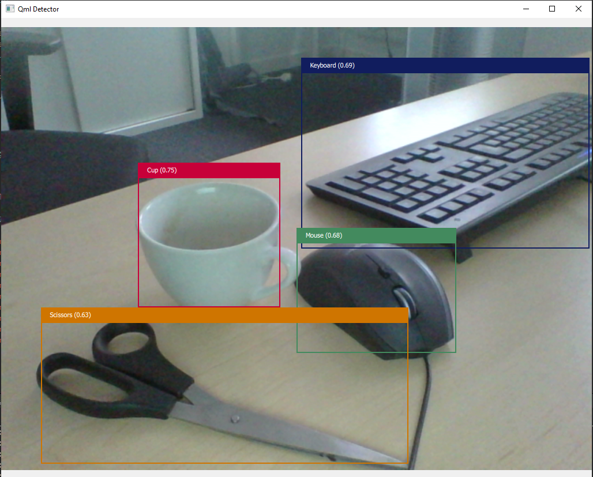

# QMLMobileNet

This project showcases how to set up a Qt5/QtQuick application for object detection
using Tensorflow Lite (TFLite).



---

## Requirements

This project needs Qt 5.15

## Build Instructions

### Step 1: Clone the Dependencies

```bash
git submodule update --init
```

### Step 2: Download the Model and Label Files

**Download the Model File**

The model file can be downloaded from Kaggle:  
[SSD MobileNet V1 TFLite Model](https://www.kaggle.com/models/tensorflow/ssd-mobilenet-v1/tfLite/metadata/1?lite-format=tflite&tfhub-redirect=true)  
Extract the downloaded `.tar` archive and rename the model file to:  
`ssd_mobilenet_v1_1_metadata_1.tflite`

**Download the Labels File**

The labels file from the COCO dataset can be downloaded from:  
[COCO Labels](https://dl.google.com/coral/canned_models/coco_labels.txt)

**Move Files**

Place both files (`ssd_mobilenet_v1_1_metadata_1.tflite` and `coco_labels.txt`) into the `model/` directory.

### Step 3: Fix TensorFlow Lite Build Issues

Building TensorFlow Lite does not work out of the box. Follow these steps to resolve the issues:

**1. Update the CMakeLists.txt File**

Open the file:  
`3rdparty/tensorflow/tensorflow/lite/CMakeLists.txt`  
Replace all occurrences of `${PROJECT_SOURCE_DIR}` with `${CMAKE_SOURCE_DIR}`.

**2. Include Benchmark Sources in TFLITE_BENCHMARK_SRCS**

Locate the following lines in the file and move them before the `add_library(tensorflow ...)` line:
```cmake
# Move these lines to the top
list(APPEND TFLITE_BENCHMARK_SRCS
  ${TF_SOURCE_DIR}/core/util/stats_calculator.cc
  ${TFLITE_SOURCE_DIR}/profiling/memory_info.cc
  ${TFLITE_SOURCE_DIR}/profiling/platform_profiler.cc
  ${TFLITE_SOURCE_DIR}/profiling/profile_summarizer.cc
  ${TFLITE_SOURCE_DIR}/profiling/profile_summary_formatter.cc
  ${TFLITE_SOURCE_DIR}/profiling/time.cc
  ${TFLITE_SOURCE_DIR}/tools/command_line_flags.cc
  ${TFLITE_SOURCE_DIR}/tools/delegates/default_execution_provider.cc
  ${TFLITE_SOURCE_DIR}/tools/evaluation/utils.cc
  ${TFLITE_SOURCE_DIR}/tools/optimize/sparsity/format_converter.cc
  ${TFLITE_SOURCE_DIR}/tools/tool_params.cc
)
```

**3. Add TFLITE_BENCHMARK_SRCS to tensorflowlite Target**

Ensure the `tensorflowlite` library includes `TFLITE_BENCHMARK_SRCS`. Update the `add_library` command as follows:

```cmake
add_library(tensorflowlite
  ${TFLITE_CORE_API_SRCS}
  ${TFLITE_CORE_SRCS}
  ${TFLITE_C_SRCS}
  ${TFLITE_DELEGATES_FLEX_SRCS}
  ${TFLITE_DELEGATES_NNAPI_SRCS}
  ${TFLITE_DELEGATES_SRCS}
  ${TFLITE_DELEGATES_XNNPACK_SRCS}
  ${TFLITE_EXPERIMENTAL_RESOURCE_SRCS}
  ${TFLITE_EXPERIMENTAL_RUY_PROFILER_SRCS}
  ${TFLITE_EXPERIMENTAL_RUY_SRCS}
  ${TFLITE_KERNEL_INTERNAL_OPT_INTEGER_OPS_SRCS}
  ${TFLITE_KERNEL_INTERNAL_OPT_SPARSE_OPS_SRCS}
  ${TFLITE_KERNEL_INTERNAL_OPT_SRCS}
  ${TFLITE_KERNEL_INTERNAL_REF_INTEGER_OPS_SRCS}
  ${TFLITE_KERNEL_INTERNAL_REF_SPARSE_OPS_SRCS}
  ${TFLITE_KERNEL_INTERNAL_REF_SRCS}
  ${TFLITE_KERNEL_INTERNAL_SRCS}
  ${TFLITE_KERNEL_SRCS}
  ${TFLITE_NNAPI_SRCS}
  ${TFLITE_SRCS}
  ${TFLITE_BENCHMARK_SRCS}
)
```

**4. Disable XNNPACK**

Locate the XNNPACK option in the CMakeLists.txt file and set it to OFF:

```cmake
option(TFLITE_ENABLE_XNNPACK "Enable XNNPACK backend" OFF)
```

### Step 4: Configure and Build the Project

1. Create and navigate to the build directory:

```bash
mkdir build && cd build
```

2. Configure the project

```bash
cmake -DCMAKE_PREFIX_PATH=~/PATH/TO/Qt5.15/gcc_64/ ..
```

3. Build the project:

```bash
make
```

### Step 5: Fix Compilation Errors (If Any)

**1. Missing `<limits>` Header**  
If you encounter an error in `graphcycles.cc`, add the following line to the include list in `abseil-cpp/absl/synchronization/internal/graphcycles.cc`:

```cpp
#include <limits>
```

**2. FarmHash Errors**  
Apply the following patches if errors occur while compiling FarmHash:

- Fix for `endian.h`:  
  [Farmhash endian.h patch](https://github.com/google/farmhash/pull/30/files/bc28ed46d4fbb73fd5cde4c989dd39d0bc8a8c56)

- Fix for `byteswap` error:  
  [TensorFlow byteswap patch](https://github.com/tensorflow/tensorflow/pull/26040#issuecomment-489428268)


Now everything should compile properly.


## License

This project is released under the GPLv3.0-or-later License.


